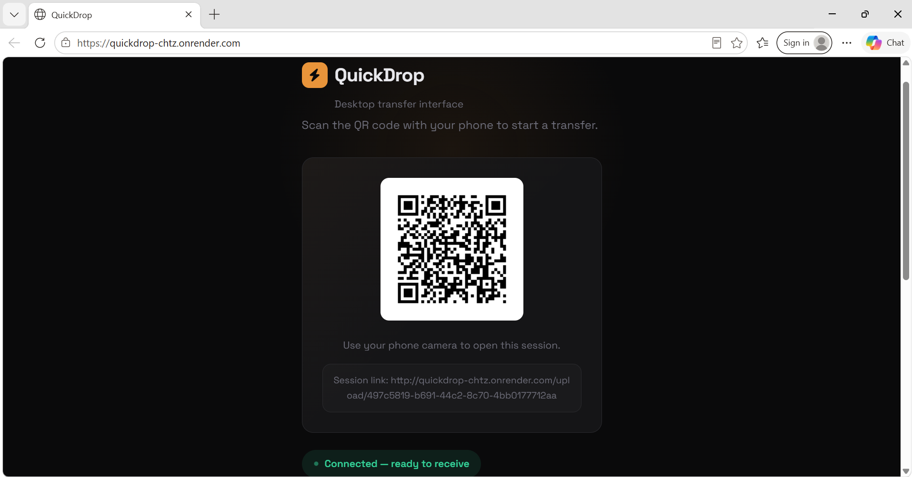
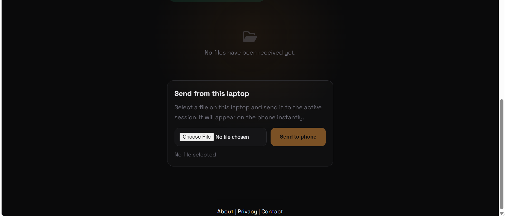
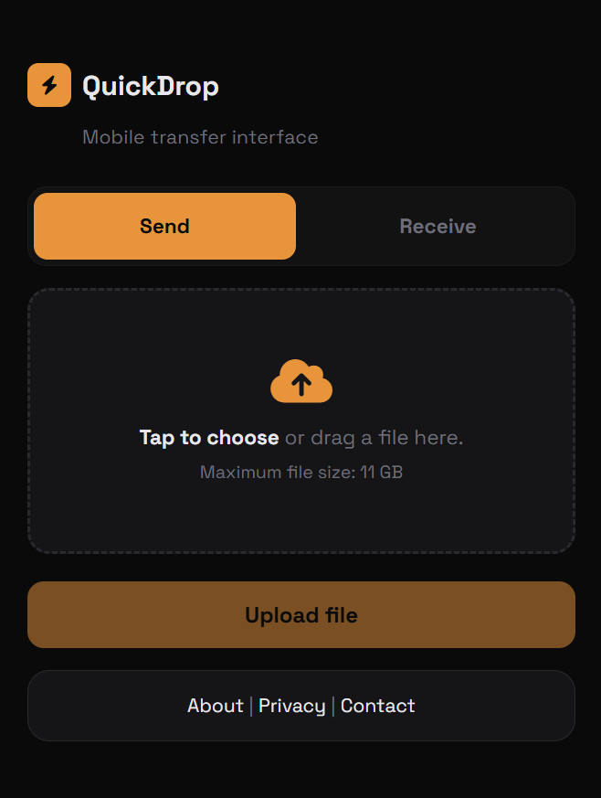
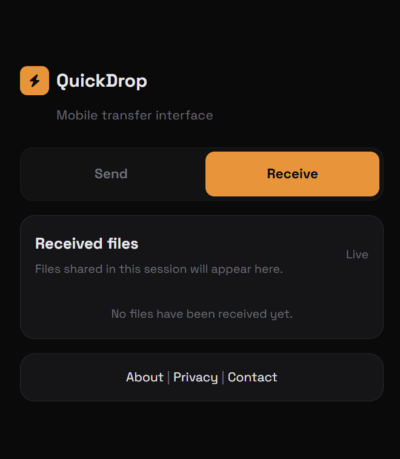

cd c:\Users\Admin\Desktop\PROJECTS\qr\quickdrop
npm install
npm start

In another terminal:
cd c:\Users\Admin\Desktop\PROJECTS\qr\quickdrop
ngrok http 3000

https://knarred-serviceable-arlo.ngrok-free.dev


# QuickDrop

QuickDrop is a real-time QR-based file transfer web app that allows users to send files from a phone to a laptop instantly through a browser.

The receiver opens the QuickDrop website on a laptop, scans a generated QR code using a phone, uploads a file, and the file appears instantly on the receiver page using Socket.IO real-time communication.

---

## Live Demo

🌐 Live Website:

https://quickdrop-chtz.onrender.com/


---

# Features

* QR-based device connection
* Real-time file transfer
* Phone-to-laptop uploads
* Instant receiver updates using Socket.IO
* Simple and clean interface
* Unique transfer sessions
* Browser-based (no app installation required)
* Public internet access using Render deployment

---

# Technologies Used

| Technology          | Purpose                 |
| ------------------- | ----------------------- |
| Node.js             | Backend runtime         |
| Express.js          | Web server and routing  |
| Socket.IO           | Real-time communication |
| Multer              | File uploads            |
| QRCode              | QR generation           |
| UUID                | Session ID generation   |
| HTML/CSS/JavaScript | Frontend UI             |
| Render              | Cloud hosting platform  |

---

# Project Structure

```bash
quickdrop/
│
├── public/
│   ├── index.html
│   └── upload.html
│
├── uploads/
│
├── server.js
├── package.json
└── README.md
```

---

# How QuickDrop Works

1. User opens the receiver page on a laptop.
2. QuickDrop generates a unique session and QR code.
3. User scans the QR code using a phone.
4. Phone opens the upload page.
5. User selects and uploads a file.
6. Receiver page instantly receives the file update through Socket.IO.

---

# Screenshots

## Desktop transfer interface





## Mobile transfer interface



## Received files



---

# Installation

Clone the repository:

```bash
git clone YOUR_GITHUB_REPO_LINK
```

Move into the project folder:

```bash
cd quickdrop
```

Install dependencies:

```bash
npm install
```

Start the server:

```bash
npm start
```

Open:

```bash
http://localhost:3000
```

---

# Deployment

QuickDrop is deployed using Render.

## Render Configuration

| Setting       | Value       |
| ------------- | ----------- |
| Runtime       | Node        |
| Build Command | npm install |
| Start Command | npm start   |

---

# Important Notes

* Uploaded files are stored temporarily in the uploads/ folder.
* Render free hosting may remove uploaded files after redeployment or restart.
* The app currently supports one file upload at a time.
* ngrok is no longer required after deployment.

---

# API Endpoints

| Endpoint         | Description            |
| ---------------- | ---------------------- |
| GET /            | Receiver page          |
| GET /session     | Creates session and QR |
| GET /upload/:id  | Sender upload page     |
| POST /upload/:id | Upload file            |

---

# Dependencies

```json
{
  "express": "^5.2.1",
  "multer": "^2.1.1",
  "qrcode": "^1.5.4",
  "socket.io": "^4.8.3",
  "uuid": "^13.0.0"
}
```

---

# Future Improvements

* Multiple file uploads
* Drag and drop support
* Progress bars
* End-to-end encryption
* Download history
* File expiration system
* Cloud storage integration
* Mobile app version

---

# License

ISC

---

# Author

Rishabh Lokhande
