cd c:\Users\Admin\Desktop\PROJECTS\qr\quickdrop
npm install
npm start

In another terminal:
cd c:\Users\Admin\Desktop\PROJECTS\qr\quickdrop
ngrok http 3000

https://knarred-serviceable-arlo.ngrok-free.dev


# QuickDrop

QuickDrop is a QR-based file transfer app that lets you send files from a phone to a laptop. The laptop shows a QR code, the phone opens the upload page, and uploaded files appear on the receiver page in real time.

## What It Does

- Creates a new sharing session and QR code when the receiver page loads
- Opens a mobile upload page when the QR code is scanned
- Uploads one file at a time using `multipart/form-data`
- Notifies the receiver in real time with Socket.IO
- Saves uploaded files in the local `uploads/` folder

## Project Files

- `server.js` - Express and Socket.IO server
- `public/index.html` - Receiver page for the laptop
- `public/upload.html` - Sender page for the phone
- `uploads/` - Folder where received files are stored

## Technologies Used

| Technology | What it does | Why QuickDrop uses it |
| --- | --- | --- |
| Node.js | Runs JavaScript on the server | Powers the backend app and handles requests |
| Express | Web framework for Node.js | Serves pages and builds the API endpoints |
| Socket.IO | Real-time browser-to-server communication | Updates the receiver page instantly when a file arrives |
| Multer | File upload middleware for Express | Receives uploaded files and saves them to disk |
| qrcode | QR code generation library | Creates the QR code shown on the laptop page |
| uuid | Unique ID generator | Creates a new session ID for each transfer |
| ngrok | Public tunnel for local apps | Makes the local app reachable from a phone on another network |
| HTML / CSS / JavaScript | Front-end web technologies | Build the sender and receiver user interfaces |

## How It Works

```mermaid
flowchart LR
  A[Laptop opens QuickDrop] --> B[Server generates session ID]
  B --> C[Server creates QR code]
  C --> D[Receiver page displays QR code]
  D --> E[Phone scans QR code]
  E --> F[Phone opens /upload/:id]
  F --> G[User selects file]
  G --> H[Browser sends file to POST /upload/:id]
  H --> I[Server saves file in uploads/]
  I --> J[Socket.IO notifies receiver page]
  J --> K[File appears on laptop screen]
```



## Requirements

- Node.js
- npm
- ngrok for phone access outside your local network

## How To Run

Important: run these commands from the `quickdrop/` folder, not from the parent `qr/` folder.

### 1. Install dependencies

```bash
npm install
```

### 2. Start the server

```bash
npm start
```

The app runs on port `3000`.

### 3. Start ngrok in a second terminal

```bash
ngrok http 3000
```

Current working public URL:

```text
https://knarred-serviceable-arlo.ngrok-free.dev
```

## How To Use

cd c:\Users\Admin\Desktop\PROJECTS\qr\quickdrop
npm install
npm start

In another terminal:
cd c:\Users\Admin\Desktop\PROJECTS\qr\quickdrop
ngrok http 3000

https://knarred-serviceable-arlo.ngrok-free.dev

1. Open the receiver page in your browser:

```text
https://knarred-serviceable-arlo.ngrok-free.dev
```

2. Scan the QR code with your phone.
3. The phone opens the upload page.
4. Choose a file and tap **Send File**.
5. The file appears on the laptop receiver page.

## Important Notes

- Use the ngrok URL when opening QuickDrop from your phone.
- `localhost` only works on the same computer.
- If ngrok restarts, the public URL may change.
- The app currently uploads one file at a time.

## API Endpoints

- `GET /` - Receiver page
- `GET /session` - Returns the session ID, QR image, and upload URL
- `GET /upload/:id` - Phone upload page
- `POST /upload/:id` - Uploads a file

## Troubleshooting

If the phone page does not open:

1. Make sure `npm start` is running in the `quickdrop/` folder.
2. Make sure `ngrok http 3000` is running.
3. Open the receiver page from the ngrok URL, not `localhost`.
4. Scan a fresh QR code after restarting the server or ngrok.

If uploads fail:

1. Check the browser console on the phone.
2. Check the server terminal for errors.
3. Confirm the file is within the size limit.

## Dependencies

```json
{
  "express": "^5.2.1",
  "multer": "^2.1.1",
  "qrcode": "^1.5.4",
  "socket.io": "^4.8.3",
  "uuid": "^13.0.0"
}
```

## License

ISC
